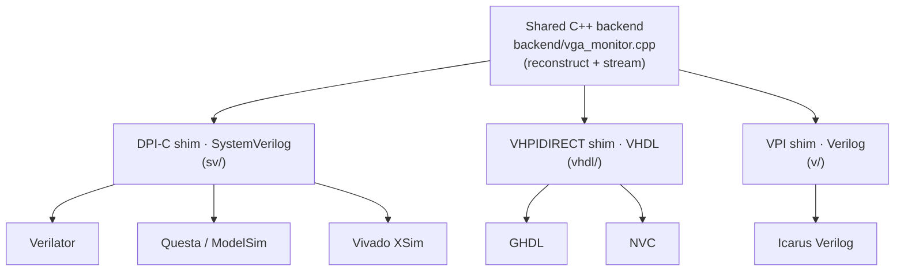
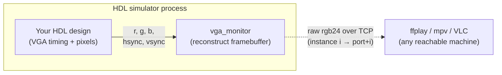

# VGA Monitor Hardware Simulation (DPI/VPI/VHPI)

Watch your HDL design's VGA output in software: no FPGA, no physical monitor.
Wire your design's VGA signals (`r, g, b, hsync, vsync`) into a drop-in
`vga_monitor` module; it reconstructs the image and **streams it as raw rgb24
over TCP to any standard viewer** (e.g. `ffplay`), like plugging a cable into a
real monitor, except the cable is a socket.

One C++ backend drives **every major HDL simulator**, across SystemVerilog,
VHDL, and Verilog, on Linux, macOS, and Windows; every path reconstructs a
**byte-identical** frame.

## Why use it

- **Zero configuration.** The monitor takes **no clock and no parameters**. Wire
  only the VGA signaling and it recovers everything from the signal itself (sync
  polarity, pixel clock, active resolution and offset), locking the way a real
  monitor's PLL does.
- **No GUI in the simulator.** No windowing toolkit is linked into the simulator
  process, so the in-process artifact is tiny and portable (libc/libstdc++ only).
  The viewer is a separate, off-the-shelf program that can run on another machine.
- **Nothing to install to *use* it.** Download the prebuilt artifact for your
  OS/arch and go: no C++ toolchain, no extra libraries on the simulator side.
- **Drop in anywhere.** The same module instantiates anywhere in your hierarchy
  in SystemVerilog, VHDL, or Verilog. Multiple instances stream to `port+i`, one
  viewer each.
- **Cross-simulator equivalence, proven.** The end-to-end test grabs a frame off
  the socket through the real viewer path and diffs it byte-for-byte against the
  golden in [golden/](golden/), so a passing run is also a cross-simulator
  equivalence proof.

## Compatibility

The same simulator-agnostic backend
([backend/vga_monitor.cpp](backend/vga_monitor.cpp)) reaches every simulator
through three thin foreign-interface shims, one per HDL:



| Simulator | HDL | Interface | Linux | macOS | Windows |
| --- | --- | --- | :-: | :-: | :-: |
| [Verilator](#verilator) | SystemVerilog | DPI-C | ✅ | ✅ | ✅ MinGW |
| [Questa / ModelSim](#questa--modelsim) | SystemVerilog | DPI-C | ✅ | — | ✅ MSVC |
| [Vivado XSim](#vivado-xsim) | SystemVerilog | DPI-C | ✅ | — | ✅ MinGW |
| [GHDL](#ghdl) | VHDL | VHPIDIRECT | ✅ | ✅ | —¹ |
| [NVC](#nvc) | VHDL | VHPIDIRECT | ✅ | ✅ | ✅ MinGW |
| [Icarus Verilog](#verilog--vpi) | Verilog | VPI | ✅ | ✅ | ✅ MinGW |

CI publishes artifacts for **Linux x86_64/arm64, macOS arm64/x86_64, and Windows
x86_64**. On Windows, pick the bundle matching your simulator's ABI:
`windows-x86_64` (**MSVC**, for Questa) or `windows-x86_64-mingw` (**MinGW**, for
Verilator / NVC / Vivado XSim); see [Getting the monitor](#getting-the-monitor-no-dependencies).

¹ On Windows the only packaged GHDL is the mcode backend, which can't link a
  VHPIDIRECT library (see [the mcode note](#ghdl-for-the-vhdl-flow)). For VHDL on
  Windows use NVC, or run the design in Questa/XSim via the SystemVerilog DPI
  wrapper.

## How it fits in your design

The monitor is a drop-in module wired only to the VGA signaling. It sits beside
your design in the same simulator process and streams each finished frame out
over a socket to a viewer that can run on another machine:



Instantiate it anywhere in your hierarchy, wired only to the VGA signals:

```systemverilog
vga_monitor m (.r, .g, .b, .hsync, .vsync);   // SystemVerilog (sv/)
```
```vhdl
mon : entity work.vga_monitor                  -- VHDL (vhdl/)
    port map (r => red, g => green, b => blue, hsync => h_sync, vsync => v_sync);
```
```verilog
vga_monitor m (.r(red), .g(green), .b(blue), .hsync(h_sync), .vsync(v_sync)); // Verilog (v/)
```

Multiple instances are supported; instance *i* (by open order) streams to
`port+i`, so each gets its own viewer.

## Layout

```
backend/   vga_monitor.cpp                      shared backend (reconstruct + stream)
sv/        vga_monitor.sv                       DPI module
vhdl/      vga_monitor.vhdl  *_pkg.vhdl  *_vhpi.cpp   VHPIDIRECT entity + shim
v/         vga_monitor.v     *_vpi.cpp  glibc_compat.c   VPI module + shim
examples/  vga_signal_generator / gradient_source           VGA timing + pattern DUT
           tb_stream (gradient) / tb_two_monitors + scroll_source + bars_box_source
           sim_main_stream.cpp / sim_main.cpp / sim_clock_main.h   clock drivers
golden/    gradient_640x480.ppm                 reference frame for the e2e test
tests/     stream_e2e.py                        ffmpeg-grab-off-socket vs golden
Makefile                                        per-simulator stream targets
```

---

# Prerequisites

There are two very different needs; keep them separate:

- **To *use* the monitor** (drive it from your simulator and watch it): your HDL
  simulator, the **prebuilt monitor artifact** for your OS/arch, and a raw-rgb24
  viewer. No C++ toolchain and no extra libraries to install. See [Usage](#usage).
- **To *build or test* from source**: a C++ toolchain plus the simulators you want
  to exercise. See [Building & testing from source](#building--testing-from-source).

## Getting the monitor (no dependencies)

Download the bundle for your platform from the
[**Releases**](https://github.com/DFiantWorks/vga-monitor-sim/releases) page (or
build it yourself with `make dist`). Each release provides a bundle for **Linux
x86_64/arm64, macOS arm64/x86_64, and Windows x86_64**. Windows ships **two**
bundles; pick the one matching your simulator's toolchain ABI: `windows-x86_64`
(MSVC, for **Questa**) and `windows-x86_64-mingw` (MinGW, for
**GHDL/NVC/Verilator and Vivado XSim**). Each bundle contains:

| File | For |
| --- | --- |
| `libvga_monitor_dpi.{so,dylib,dll}` | SystemVerilog simulators (DPI-C) |
| `libvga_monitor_vhpi.{so,dylib}` / `vga_monitor_vhpi.dll` | VHDL simulators (VHPIDIRECT) |
| `vga_monitor.vpi` (Linux, macOS, MinGW bundles) | Verilog simulators (VPI) |
| `vga_monitor_dpi.a` (MinGW bundle) | Vivado XSim: the shim XSim's GCC links (see [Vivado XSim](#vivado-xsim)) |
| `libvga_monitor_{dpi,vhpi}.dll.a` (MinGW bundle) | import libraries for MinGW-ABI tools that *link* the DLL (Verilator, GHDL); runtime loaders like NVC don't need them |
| `vga_monitor.sv` / `.vhdl` + `_pkg.vhdl` / `.v` | the HDL wrapper to add to your sources |

Tagged releases (`v*`) also attach a per-platform archive
`vga-monitor-<version>-<platform>.tar.gz` to the GitHub Release, in which every
file carries a version token (`vga_monitor_v1_4_0.sv`,
`libvga_monitor_dpi_v1_4_0.so`, `vga_monitor_v1_4_0.vpi`, …) so multiple versions
can coexist in one directory. The **module/entity, C-ABI, and `$system-task`
names inside the files are unchanged**, only the filenames are versioned, so
upgrading is a one-line edit to your source list and `-l`/`-sv_lib`/`--load`/`-m`
references (e.g. `-sv_lib vga_monitor_dpi_v1_4_0`), nothing else. (The MinGW
import libraries are the one exception: they embed the unversioned DLL name, so
they're omitted from versioned archives; link a versioned DLL by generating an
import lib with `dlltool`, or load it at runtime.)

The prebuilt libraries carry **no simulator headers**, so they load into any
matching simulator as-is. On Linux/macOS libstdc++/libgcc are folded in, so the
only runtime dependency is libc; **nothing else to install on the simulator
side**.

## A viewer, per OS

Any program that reads raw rgb24 from a TCP socket works; `ffplay` (shipped with
**ffmpeg**) is the simplest and is used throughout below.

| OS | Install ffmpeg |
| --- | --- |
| Linux (Debian/Ubuntu) | `sudo apt install ffmpeg` |
| macOS | `brew install ffmpeg` |
| Windows | `winget install Gyan.FFmpeg` (or `scoop install ffmpeg` / `choco install ffmpeg`) |

The viewer **listens**; the simulator connects to it once geometry locks. The
same command works on every OS (on Windows use `ffplay.exe`):

```bash
ffplay -f rawvideo -pixel_format rgb24 -video_size 640x480 -i 'tcp://0.0.0.0:5000?listen=1'
```

Alternatives that also read raw rgb24: `mpv`, VLC, GStreamer.

---

# Usage

The flow is the same for every simulator:

1. **Get the monitor** for your platform: the prebuilt library + HDL wrapper (see
   [Getting the monitor](#getting-the-monitor-no-dependencies)).
2. **Wire** the monitor into your design (one line, see the snippets above).
3. **Start a viewer** (it listens; see [A viewer, per OS](#a-viewer-per-os)).
4. **Run your simulator** with `VGA_MONITOR_STREAM=host:port` set.

The frame size is fixed once geometry locks, so a standard viewer needs the
resolution up front (`-video_size`); the monitor logs the locked geometry
(`auto-locked 640x480 ...`); read that line, then point the viewer at it. Two
environment variables control a run:

| Variable | Effect |
| --- | --- |
| `VGA_MONITOR_STREAM=host:port` | stream finished frames as raw rgb24 (instance *i* → `port+i`) |
| `VGA_MONITOR_FRAMES=<N>` | exit after N complete frames |

The viewer can be anywhere reachable, e.g. the simulator on a headless server
streaming to `ffplay` on your laptop. On Windows set the variable with
`set VGA_MONITOR_STREAM=127.0.0.1:5000` (cmd) or `$env:VGA_MONITOR_STREAM=...`
(PowerShell) before launching the simulator.

Add the wrapper that matches your HDL and point your simulator at the prebuilt
library for the interface it speaks. Pick the section below for your flow. In the
commands, `<dist>` is the directory holding the
[downloaded artifact](#getting-the-monitor-no-dependencies).

## SystemVerilog — DPI-C

For **Verilator, Questa/ModelSim, Vivado XSim** and any other DPI simulator. Add
`vga_monitor.sv` to your sources and supply `libvga_monitor_dpi.{so,dylib,dll}`.
`-sv_lib` takes the base name **without** the `lib` prefix or extension
(`vga_monitor_dpi`).

### Verilator

Link the library at build time, then run:

```bash
verilator --binary --timing -j 0 --top-module my_tb \
    my_tb.sv my_design.sv vga_monitor.sv \
    -LDFLAGS "-L<dist> -lvga_monitor_dpi"
LD_LIBRARY_PATH=<dist> VGA_MONITOR_STREAM=127.0.0.1:5000 ./obj_dir/my_tb
```

### Questa / ModelSim

Load the library at `vsim` time:

```bash
vlog my_tb.sv my_design.sv vga_monitor.sv
VGA_MONITOR_STREAM=127.0.0.1:5000 \
    vsim -c my_tb -sv_lib <dist>/vga_monitor_dpi -do "run -all; quit"
```

### Vivado XSim

Use the **`windows-x86_64-mingw`** bundle. Link `-sv_lib vga_monitor_dpi` with
`-sv_root` pointing at the bundle directory, and keep that directory on `PATH` at
run time:

```bash
xvlog -sv my_tb.sv my_design.sv vga_monitor.sv
xelab my_tb -s sim -sv_root <dist> -sv_lib vga_monitor_dpi
LD_LIBRARY_PATH=<dist> VGA_MONITOR_STREAM=127.0.0.1:5000 xsim sim -R   # <dist> on PATH (Windows)
```

For a versioned release, point it at the versioned DLL with
`VGA_MONITOR_DLL=vga_monitor_dpi_v1_4_0.dll`. (`xsc`/XSim aren't installable in
CI, so this path is verified manually, not in the test suite.)

## VHDL — VHPIDIRECT

For **GHDL** and **NVC**. Analyze `vga_monitor_pkg.vhdl` + `vga_monitor.vhdl`
alongside your design and supply `libvga_monitor_vhpi.{so,dylib}` (self-contained,
libstdc++/libgcc folded in). On Windows use `vga_monitor_vhpi.dll` from the
**`windows-x86_64-mingw`** bundle, since GHDL and NVC are MinGW-based there.

> The VHPIDIRECT wrapper binds via GHDL's `foreign` convention, which **GHDL and
> NVC** implement. For a VHDL design in **Questa or Vivado XSim**, don't use this
> wrapper; both are mixed-language, so instantiate the SystemVerilog
> `vga_monitor` module instead and use the DPI library
> ([SystemVerilog — DPI-C](#systemverilog--dpi-c)).

### GHDL

Link the library at elaboration:

```bash
ghdl -a --std=08 vga_monitor_pkg.vhdl vga_monitor.vhdl my_design.vhdl my_tb.vhdl
ghdl -e --std=08 -Wl,-L<dist> -Wl,-lvga_monitor_vhpi my_tb
LD_LIBRARY_PATH=<dist> VGA_MONITOR_STREAM=127.0.0.1:5000 ./my_tb
```

### NVC

Load the library at run time:

```bash
nvc --std=2008 -a vga_monitor_pkg.vhdl vga_monitor.vhdl my_design.vhdl my_tb.vhdl
nvc --std=2008 -e my_tb
VGA_MONITOR_STREAM=127.0.0.1:5000 nvc --std=2008 -r my_tb --load <dist>/libvga_monitor_vhpi.so
```

## Verilog — VPI

For **Icarus Verilog** and other VPI-capable simulators. Add `vga_monitor.v` to
your sources and load the prebuilt `vga_monitor.vpi` module with `vvp -m`. On
Windows use the `vga_monitor.vpi` from the **`windows-x86_64-mingw`** bundle,
since Icarus is MinGW-based there.

```bash
iverilog -g2012 -o my_tb.vvp -s my_tb my_tb.v my_design.v vga_monitor.v
VGA_MONITOR_STREAM=127.0.0.1:5000 vvp -M<dist> -m vga_monitor my_tb.vvp
```

(If your `vvp` bundles an older glibc than the `.vpi` was built against, e.g.
oss-cad-suite, see [the Icarus glibc note](#icarus-glibc-note).)

---

# Building & testing from source

This is only needed if you want to build the monitor yourself or run the test
suite; using a published artifact requires none of this.

## Prerequisites

On Debian/Ubuntu, install a C++ toolchain plus whichever simulators you want:

```bash
sudo apt update
sudo apt install build-essential verilator iverilog python3 ffmpeg iproute2
```

`verilator` is the SystemVerilog flow, `iverilog` the Verilog/Icarus flow,
`ffmpeg` provides the `ffplay` viewer and the end-to-end test's frame grab, and
`iproute2` provides `ss` (used by the test to detect the listening viewer).

### GHDL (for the VHDL flow)

Use GHDL's **gcc** or **llvm** backend; the distro package is enough:

```bash
sudo apt install ghdl-llvm     # or ghdl-gcc
```

> **The mcode backend is not supported.** mcode has no link step, so it can only
> bind a VHPIDIRECT subprogram by naming the shared library *inside* the VHDL
> `foreign` attribute, which NVC (sharing the same `vga_monitor_pkg.vhdl`) does
> not accept. The gcc/llvm backends link the C++ backend at elaboration, which is
> also GHDL's recommended path for VHPIDIRECT. Override the binary with
> `GHDL=/path/to/ghdl` if you have several installed.

To build a specific backend from source instead (e.g. LLVM):

```bash
sudo apt install -y git make gnat zlib1g-dev libreadline-dev \
                    libffi-dev libgmp-dev libboost-all-dev \
                    gcc g++ python3-pip llvm clang cmake
git clone https://github.com/ghdl/ghdl.git
cd ghdl
./configure --prefix=/usr/local --with-llvm-config
make -j$(nproc)
sudo make install
```

## Build and run the examples

Start a viewer first (it listens); the simulator connects once geometry locks:

```bash
ffplay -f rawvideo -pixel_format rgb24 -video_size 640x480 -i 'tcp://0.0.0.0:5000?listen=1'

make stream-dpi           # 640x480 gradient via Verilator (DPI)
make stream-vhpi          # via GHDL (VHPIDIRECT)
make stream-nvc           # via NVC  (VHPIDIRECT)
make stream-vpi           # via Icarus (VPI)
make stream-two           # two MOVING patterns -> two viewers (ports 5000, 5001)
make clean
```

Override the target with `STREAM=host:port` (default `127.0.0.1:5000`).

The VHDL flow links `backend/vga_monitor.cpp` + `vhdl/vga_monitor_vhpi.cpp` and
analyzes `vhdl/vga_monitor_pkg.vhdl` + `vhdl/vga_monitor.vhdl`; the Icarus flow
builds a VPI module from `backend/vga_monitor.cpp` + `v/vga_monitor_vpi.cpp` and
loads it with `vvp -m vga_monitor`. See the `stream-*` targets in the
[Makefile](Makefile) for the exact commands.

## End-to-end test

```bash
make stream-test          # build from source; SIM=dpi|vhpi|nvc|vpi|all (default all)
make dist-test            # drive the PREBUILT artifacts in $(DIST) instead
```

For each simulator this starts `ffmpeg` as the viewer, grabs exactly one frame
off the socket, and compares it byte-for-byte to the committed golden, exiting
non-zero on any mismatch. It needs `ffmpeg` and either `ss` or `netstat`, and
**skips any simulator whose tool isn't installed** (logging the skip), so the
same command runs on Linux, macOS, and Windows with whatever FOSS simulators are
present.

`dist-test` is what CI's `artifact-test` job runs on Linux and macOS: it
downloads the published bundle and drives the design against the shipped
libraries with every available FOSS simulator (Verilator/DPI, GHDL + NVC/VHPI,
Icarus/VPI), proving the artifacts work without recompiling the backend.

## Build the shareable library yourself

The backend compiles standalone into portable shared libraries that the
simulators load alongside the HDL wrappers, no need to rebuild on the target:

```bash
make dist     # build/dist/libvga_monitor_{dpi,vhpi}.{so,dylib} (+ the HDL wrappers)
```

On Linux libstdc++/libgcc are folded in, so the only runtime dependency is libc.
CI ([.github/workflows/ci.yml](.github/workflows/ci.yml)) builds these libraries
for every published platform (plus the VPI module on Linux) and uploads
each as a downloadable artifact, so you can grab binaries for the target machine
instead of compiling there.

### Icarus glibc note

The `.vpi` links no display toolkit, only libc/libstdc++. One portability bit
remains for simulators that bundle an **older glibc** than your compiler (e.g.
oss-cad-suite's `vvp`): [v/glibc_compat.c](v/glibc_compat.c) +
`-Wl,--wrap=__isoc23_strtol`, plus the Makefile detecting that layout and running
oss-cad-suite's `vvp` against the system loader/libs. On a normal
(distro-packaged) `iverilog` it's a plain `vvp` call. Override with `VVP=...`.

## License

Licensed under the MIT License (see [LICENSE](LICENSE)).

This is a derivative work. Portions derive from the original project by
MaysAbdallah (Copyright © 2025), used under the MIT License; that copyright
notice is retained in [LICENSE](LICENSE). Subsequent modifications are
Copyright © 2026 DFiant Inc.

# Related Work
https://github.com/MaysAbdallah/VGA-Monitor-Simulation
https://github.com/meiniKi/simio

